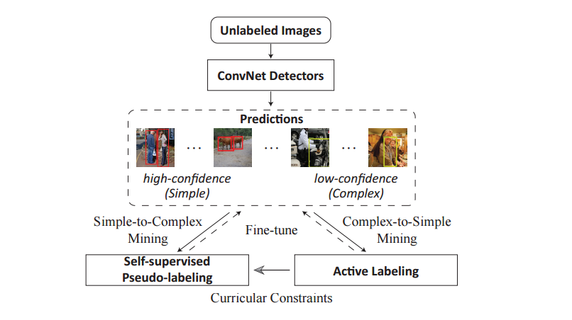

# ASM (the Unofficial Version of Pytorch Implementation)

**<a href="https://arxiv.org/pdf/1807.00147.pdf">Cost-Effective Object Detection: Active Sample Mining with Switchable Selection Criteria</a>**

<a href="http://kezewang.com">Keze Wang</a>,
<a href="http://www.linliang.net/">Liang Lin</a>,
<a href="https://yanxp.github.io/">Xiaopeng Yan</a>,
Ziliang Chen,
Dongyu Zhang,
<a href="http://www4.comp.polyu.edu.hk/~cslzhang/">Lei Zhang</a>

Sun Yat-Sen University, Presented at [TNNLS](https://cis.ieee.org/ieee-transactions-on-neural-networks-and-learning-systems.html)	

### License

For Academic Research Use Only!

### Citing ASM

If you find ASM useful in your research, please consider citing:

    @article{wang18asm,
        Author = {Keze Wang,Liang Lin, Xiaopeng Yan, Ziliang Chen, Dongyu Zhang, Lei Zhang},
        Title = {{ASM}: Cost-Effective Object Detection: Active Sample Mining with Switchable Selection Criteria},
        Journal = {IEEE Transactions on Neural Networks and Learning System(TNNLS)},
        Year = {2018}
    }

### Dependencies 

The code is built on top of https://github.com/ruotianluo/pytorch-faster-rcnn. Please carefully read through the pytorch-faster-rcnn instructions and make sure pytorch-faster-rcnn can run within your enviornment.

### Datasets/Pre-trained model

1. In our paper, we used Pascal VOC2007/VOC2012 and COCO as our datasets, and res101.pth model as our pre-trained model.

2. Please download ImageNet-pre-trained res101.pth model manually, and put them into $ASM_ROOT/data/imagenet_models

### Usage

1. training

    Before training, please prepare your dataset and pre-trained model and store them in the right path as R-FCN.You can go to ./tools/ and modify train_net.py to reset some parameters.Then, simply run sh ./train.sh.

2. testing (only single scale image test implementation)

   Before testing, you can modify test.sh to choose the trained model path, then simply run sh ./test.sh to get the evaluation result.

### Misc

Tested on Ubuntu 14.04 with a Titan X GPU (12G) and Intel(R) Xeon(R) CPU E5-2623 v3 @ 3.00GHz.
